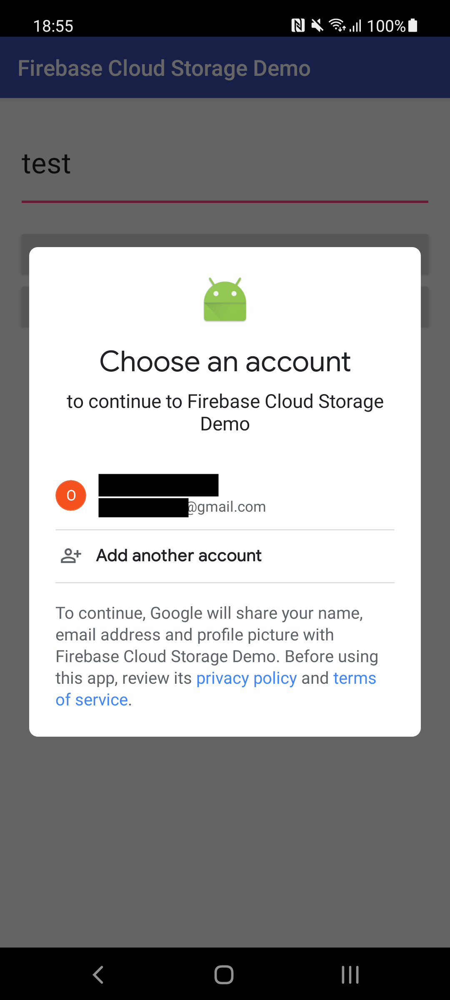

# Firebase Cloud Storage Demo

Firebase Cloud Storage Demo with user authentication.

## Step 1 - Setup Firebase Authentication with Google Sign In

Follow the instructions [here](https://firebase.google.com/docs/auth/android/google-signin?authuser=0)

## Step 2 - Setup Firebase Cloud Storage

Follow the instructions [here](https://firebase.google.com/docs/storage/android/start?authuser=0#create-default-bucket).

Then set the security rules to allow only authenticated users to read/write their own files:

```
service firebase.storage {
  match /b/myfirebaseapp.appspot.com/o {
    match /mydata/{userId}/{allPaths=**} {
      allow read, write: if request.auth != null && request.auth.uid == userId;
    }
  }
}
```

Here `myfirebaseapp.appspot.com` is yout Firebase app URL and `mydata` must match the directory (in Cloud Storage terminology called "reference") present in the code.

## Usage

Write something in the textfield, then click Write. The user will be prompted to choose a Google account configured on the phone. This popup will appear again if the user clears the app data/uninstall and reinstalls the app. Subsequent reads/writes will require no user interaction.



A file will be created in Cloud Storage at:
```
gs://myfirebaseapp.appspot.com/mydata/9XhbzptcFyNha6kV4kQP17iW1HI2/foo.txt
```
where `9XhbzptcFyNha6kV4kQP17iW1HI2` is the `uid` of the Firebase Auth account. You can see the registered accounts and their `uid` in the [Firebase Auth console](https://console.firebase.google.com/u/0/project/venator85/authentication/users).


On another device, tap Read. The file content will appear in the textfield.


## License
[MIT](https://choosealicense.com/licenses/mit/)
